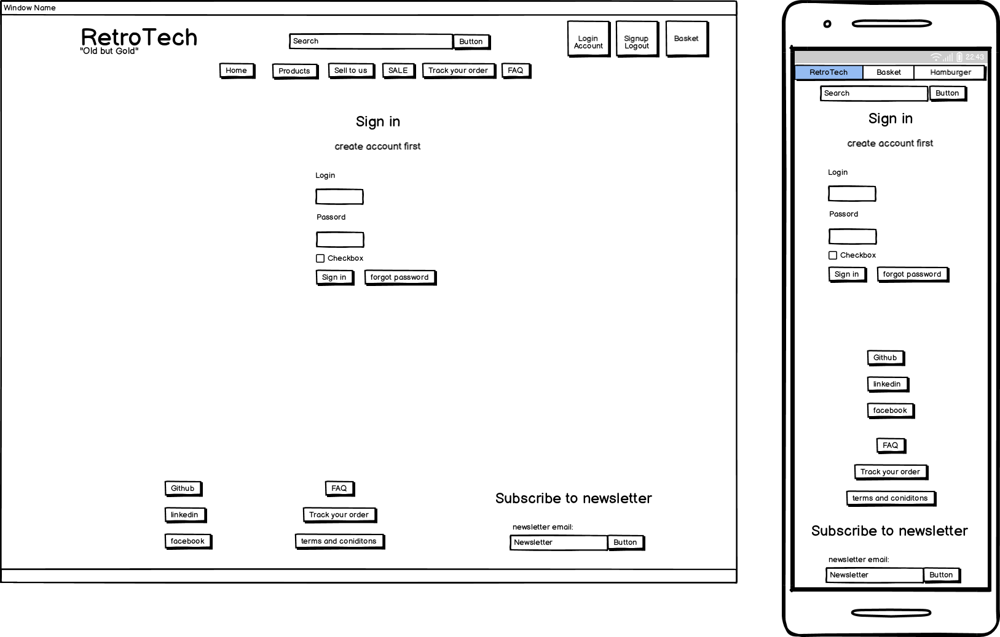
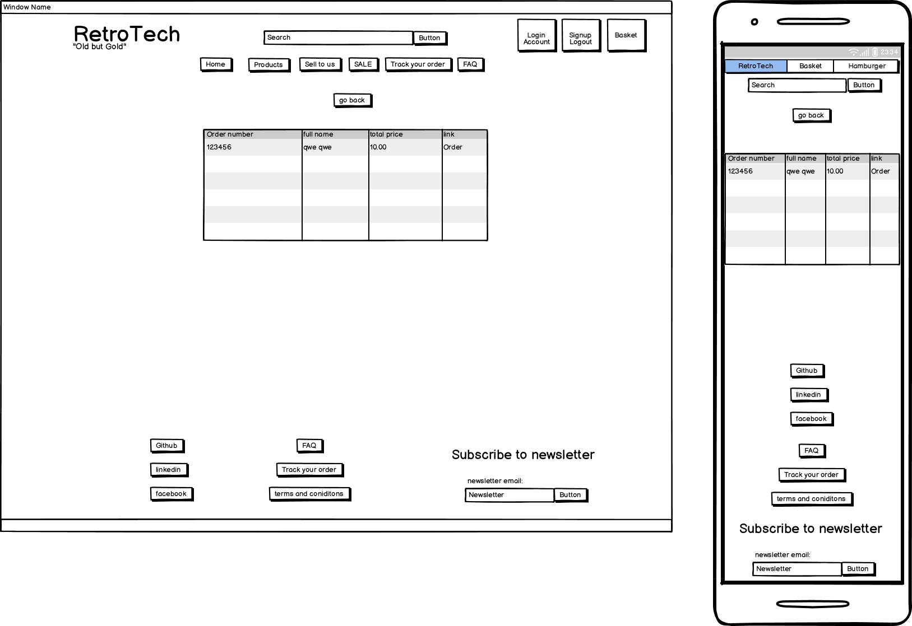
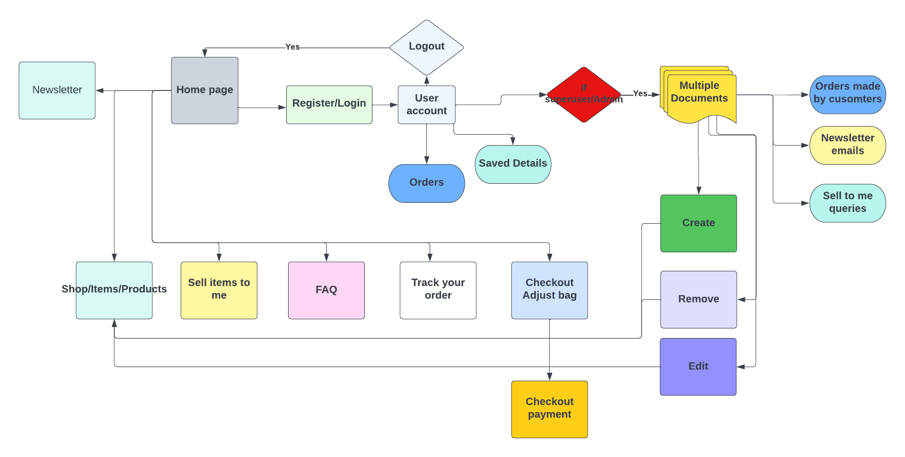
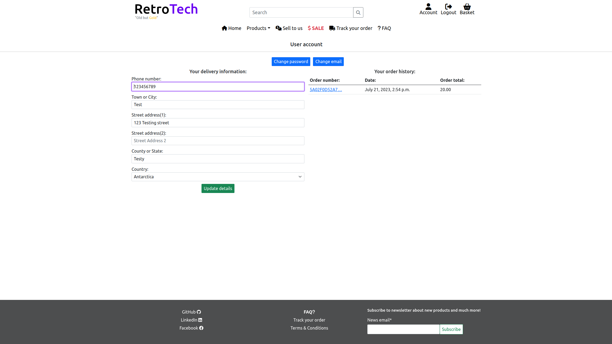
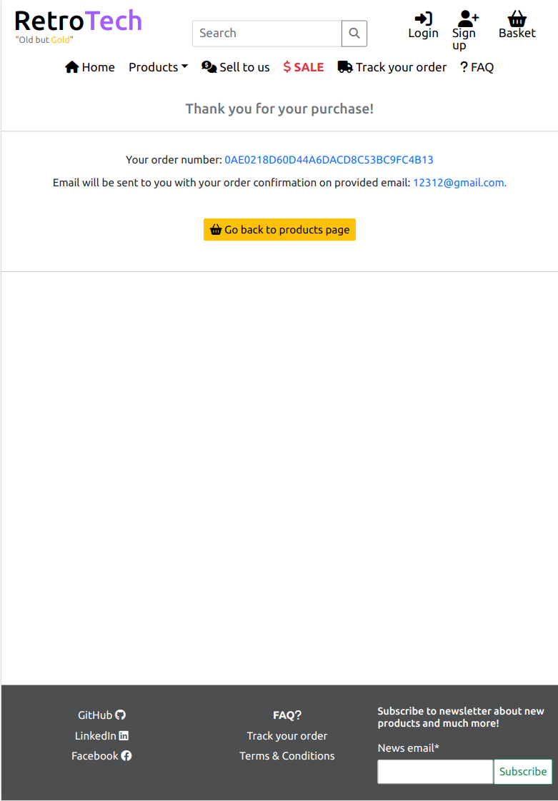
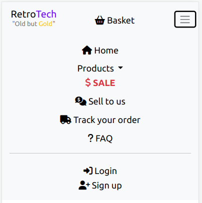
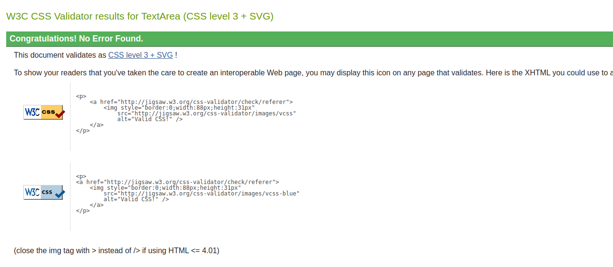
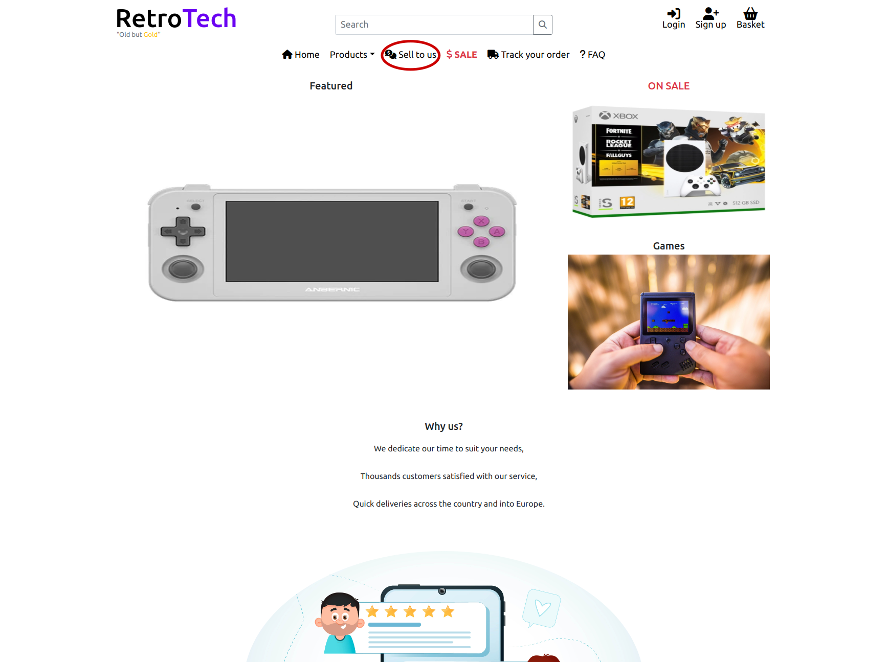
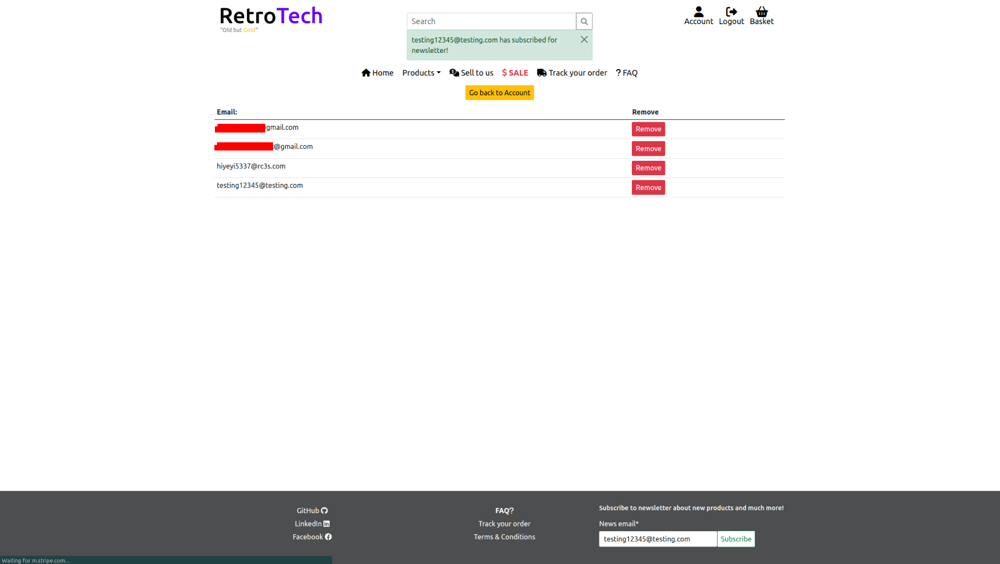

# RetroTech shop

Welcome to my project about shop called **RetroTech**. This shop is about handheld consoles mainly but will have other ones as well like PlayStation or Xbox and ability to sell them to me.


## Table of content:

- [Motivation](#motivation)
- [User Experience](#user-experience-ux)
    - [User Stories](#user-stories)
    - [Website Goals](#website-goals)
    - [Requirements](#requirements)
    - [Expectations](#expectations)
    - [Design](#design)
    - [Wireframes](#wireframes)
        - [Desktop](#desktop)
        - [Tablet](#tablet)
        - [Mobile](#mobile)
- [Authentication](#authentication)
- [Data Structure](#data-structure)
- [Website Structure](#website-structure)
- [Technology, Frameworks and Programs used](#technology-frameworks-and-programs-used)
    - [Languages](#languages)
    - [Frameworks and programs used](#frameworks-and-programs-used)
- [Features](#features)
    - [Navigation bar](#navigation)
- [Testing](#testing)
- [Testing user stories](#testing-user-stories)
- [Deployment](#deployment)
- [Credits](#credits)

# Motivation

Motivation for this project is to sell and buy consoles on this website.

# User Experience (UX)

## User Stories
- User Story
    - As a user, I want to land on main page.
    - As a user, I want to be able to navigate through main page.
    - As a user, I want to be able to navigate through categories.
    - As a user, I want to be able to contact owner to sell my console or handheld device.
    - As a user, I want to be able to navigate through sales page.
    - As a user, I want to be able to buy device of the website.
    - As a user, I want to be able to see what kind of device website has to offer.
    - As a user, I want to be able to create account.
    - As a user, I want to be able to store my details on my account.
    - As a user, I want to be able to add item to shopping bag.
    - As a user, I want to be able to continue shopping after adding one or more items in the bag.
    - As a user, I want to be able to pay for my shopping with Stripe.
    - As a user, I want to be able to sign up for newsletter.

[Back to top](#)

## Website Goals

Websites goal is to promote my RetroTech shop and gain new customers.

## Agile Methodology

- This project uses Agile methodology with kanban board, each user story represents as **EPIC** and its smaller issues are **TASKS**
- I have implemented **iterations** every week every thursday was iteration last week before deadline will be last iteration till deadline date.

    <details><summary>Kanban board screenshot</summary>
    
    </details>
    <br>

## Facebook Marketing

- E-commerce online shopping site selling Retro handheld devices and more, You can sell your console or handheld to us as well.
- Purpose of Facebook business page is to extend reach to new customers and hopefully returning ones.
- Business model is Business to customer(B2C) 


## Requirements

- Home page.
- Categories with products.
- Checkout.
- Sales.
- Newsletter.
- Sell to us.
- Login system.
- Storing cusomter details if logged in.

## Expectations

- I expect my website will attract new customers.
- I expect my website will have home page.
- I expect my website will have categories and products.
- I expect my website will let customers buy devices from my website.
- I expect my website will let customers sell their devices to me if they are in good condition.
- I expect my website will let customers add more than one item into bag.
- I expect my website will let users create profile account and store their details.

## Design

- Colors
    - Colors used on website are:

    - Gold: #ffc107;

        

    - Purple: #6A02F2;

        
    
    - Grey: ##4d4e4f;

        

    - light grey: #eeebeb;

        

    - white: #fff;

        

- Fonts:

    Font was used default from Boostrap 5, [Helvetica Neue](https://fontsgeek.com/helvetica-neue-font), [Helvetica](https://fontsgeek.com/helvetica-font), [Arial](https://fontsgeek.com/arial-font), and [sans-serif](https://fontsgeek.com/sans-serif-font) in its default font stack.

- Images: 

    - [Freepik](https://www.freepik.com/free-vector/reviews-concept-landing-page_5156335.htm#query=reviews&position=27&from_view=search&track=locales")

    - [Currys.ie](https://www.currys.ie/)

    - [Smyths](https://www.smythstoys.com/ie/en-ie/)

    - [Retroid](https://www.goretroid.com/)

    - [Anbernic](https://anbernic.com/)

[Back to top](#)

## Wireframes

- Navbar.

    <details><summary>Picture</summary>
    
    </details>
    <br>

- Footer.

    <details><summary>Picture</summary>
    
    </details>
    <br>

- Home page.

	<details><summary>Picture</summary>
    
    </details>
    <br>

- Products/Categories.

	<details><summary>Picture</summary>
    
    </details>
    <br>

- Product Details.

    <details><summary>Picture</summary>
    
    </details>
    <br>

- Basket.

	<details><summary>Picture</summary>
    
    </details>
    <br>

- Checkout.

	<details><summary>Picture</summary>
    
    </details>
    <br>

- Checkout Success.

    <details><summary>Picture</summary>
    
    </details>
    <br>

- Sales.

	<details><summary>Picture</summary>
    
    </details>
    <br>

- Sell to us.

	<details><summary>Picture</summary>
    
    </details>
    <br>

- FAQ.

	<details><summary>Picture</summary>
    
    </details>
    <br>

- Front end admin panel.

	<details><summary>Picture</summary>
    
    </details>
    <br>

- Login.

	<details><summary>Picture</summary>
    
    </details>
    <br>

- Logout.

	<details><summary>Picture</summary>
    
    </details>
    <br>

- Sign up.

	<details><summary>Picture</summary>
    
    </details>
    <br>

- Profile account.

	<details><summary>Picture</summary>
    
    </details>
    <br>

- Order History.

	<details><summary>Picture</summary>
    
    </details>
    <br>

- Profile account **ADMIN SIDE**.

    <details><summary>Picture</summary>
    
    </details>
    <br>

- Edit Product **ADMIN SIDE**

    <details><summary>Picture</summary>
    
    </details>
    <br>

- Orders **ADMIN SIDE**

    <details><summary>Picture</summary>
    
    </details>
    <br>

- Orders details **ADMIN SIDE**

    <details><summary>Picture</summary>
    
    </details>
    <br>

- Sell to me **ADMIN SIDE**

    <details><summary>Picture</summary>
    
    </details>
    <br>

- Sell to me details **ADMIN SIDE**

    <details><summary>Picture</summary>
    
    </details>
    <br>

- Newsletter.

    <details><summary>Picture</summary>
    
    </details>
    <br>

- Terms & Conditions.
    
    <details><summary>Picture</summary>
    
    </details>
    <br> 

- Track your order.
    
    <details><summary>Picture</summary>
    
    </details>
    <br> 

# Authentication and Security

### Authentication

- Project uses [Allauth](https://django-allauth.readthedocs.io/en/latest/) as login system, pages were adjusted and styled. Emailing system to login, email confirmation, password recovery and so on works and is being sent.

- Unwanted visitors trying to access restricted pages in project will be redirected to home with message that they are allowed on this site. ``@Login_required`` and 

    ```
    if not request.user.is_superuser:
        messages.error(request, 'You arent allowed there! \
                        redirecting to home page.')
        return redirect(reverse('home'))
        ```

### Security

- All secret keys are stored in **env.py** or stored in variables in [Heroku](https://www.heroku.com/).

# Data Structure

## Database

Category:
| Object | Field |
|---|---|
| ID | is automatically generated |
| name | CharField |
| frontend_name | CharField |

name is given category_choices of handheld, console, games, accessories.
<hr>

Item:
| Object | Field |
|---|---|
| ID | is automatically generated |
| category | ForeignKey to Category model |
| sku_number | CharField |
| product_name | CharField |
| product_model | CharField |
| product_description | TextField |
| price | DecimalField |
| original_price | DecimalField |
| sale | Boolean |
| featured | Boolean |
| image_one | CloudinaryField |
| image_two | CloudinaryField |
| image_three | CloudinaryField |

<hr>

SellToUS:
| Object | Field |
|---|---|
| ID | is automatically generated |
| full_name | CharField |
| email | EmailField |
| brand | CharField |
| model | CharField |
| grade | CharField |
| description | TextField |
| sell_image_one | CloudinaryField |
| sell_image_two | CloudinaryField |
| sell_image_three | CloudinaryField |

<hr>

UserProfile:
| Object | Field |
|---|---|
| ID | is automatically generated |
| user | OnetoOneField with User |
| default_phone_number | CharField |
| default_town_or_city | CharField |
| default_street_address1 | CharField |
| default_street_address2 | CharField |
| default_postcode | CharField |
| default_county_state | CharField |
| default_country | CountryField |

User is imported from django.contrib.auth.models
<hr>

Newsletter:
| Object | Field |
|---|---|
| ID | is automatically generated |
| news_email | EmailField |

newsletter email is called news_email because I made my own context_processors that would pull all email id's from websie when they were provided. This way it prevents unwanted newsletter signups.

<hr>

Order:
| Object | Field |
|---|---|
| ID | is automatically generated |
| order_number | CharField |
| user_profile | ForeignKey to UserProfile |
| full_name | CharField |
| email | EmailField |
| phone_number | CharField |
| country | CountryField |
| postcode | CharField |
| town_or_city | CharField |
| street_address1 | CharField |
| street_address2 | CharField |
| county_state | CharField |
| date | DateTimeField |
| order_total | DecimalField |
| grand_total | DecimalField |
| original_basket | TextField |
| stripe_pid | CharField |

order_total adds up all lineitems,
grand_total is order_total.
order_number is generated by uuid4 with hex and Upper letters.

<hr>

OrderLineItem:
| Object | Field |
|---|---|
| ID | is automatically generated |
| order | ForeignKey to Order |
| item | ForeignKey to Item |
| quantity | IntegerField |
| lineitem_total | DecimalField |

lineitem_total is calculated items price * quantity.

<hr>


## Logic



# Website Structure

- Most of website structure comes from Bootstrap itself, and rest is just overrides to make it look nicer.

|  Screen size |  Breakpoint |
|---|---|
| extra small | >= 320px |
| small | >= 576px |
| medium | >= 768px |
| Custom | 768 >= 900 |
| Custom | >= 990 | 

# Technology, Frameworks and Libraries used.

## Languages

- [HTML](https://en.wikipedia.org/wiki/HTML5) 

- [CSS](https://en.wikipedia.org/wiki/CSS)

- [Python](https://en.wikipedia.org/wiki/Python_(programming_language))

- [JavaScript](https://en.wikipedia.org/wiki/JavaScript)

## Frameworks and Libraries used.

- [Django](https://www.djangoproject.com/) Python-based web framework that follows the model–template–views architectural pattern.

- [Gunicorn](https://en.wikipedia.org/wiki/Gunicorn) HTTP server interface.

- [Psycopg](https://wiki.postgresql.org/wiki/Psycopg) Postgres database adaptor.

- [Stripe](https://stripe.com/) Payments.

- [Bootstrap](https://getbootstrap.com/) Bootstrap 5 was used in this project.

- [FontAwesome](https://fontawesome.com/) Icons used in this project.

- [Jquery](https://en.wikipedia.org/wiki/JQuery)

## Tools

- [Heroku](https://www.heroku.com) Deployment of website.

- [ElephantSQL](https://www.elephantsql.com/) Database storing all schemas and data.

- [Cloudinary](https://cloudinary.com/) Storing static files and images.

- [Balsamiq](https://balsamiq.com/) Wireframes.

- [Miniwebtool](https://miniwebtool.com/django-secret-key-generator/) used to generate new key.

- [Favicon](https://favicon.io/favicon-generator/) Favicon generator.

- [Freepik](https://www.freepik.com/) Freepik images

# Features

- Responsive on all devices.
- Custom Front end admin panel.
- Profile accounts.
- Saving details at checkout to user account.
- Checkout with Stripe payments.
- Products and Categories.
- Newsletter
- Emails on newsletter signup, sell to us and if checkout is successful.
- Sell to us.
- Sale.

# Navigation
	
#### Desktop and Tablets.

- Navigation bar.

    <details><summary>Picture</summary>
    
    </details>
    <br>
- Footer.

    <details><summary>Picture</summary>
    
    </details>
    <br>

- Content of index.html.

    <details><summary>Picture</summary>
    
    
    
    </details>
    <br>

- Content of products, all look the same just filtered.

    <details><summary>Picture</summary>
    
    
    </details>
    <br>

- Product details.

    <details><summary>Picture</summary>
    
    </details>
    <br>

- Sell to us.

    <details><summary>Picture</summary>
    
    
    </details>
    <br>

- Sale.

    <details><summary>Picture</summary>
    
    </details>
    <br>

- Track your order.

    <details><summary>Picture</summary>
    
    </details>
    <br>

- FAQ?.

    <details><summary>Picture</summary>
    
    </details>
    <br>

- Basket.

    <details><summary>Picture</summary>
    
    </details>
    <br>

- Checkout.

    <details><summary>Picture</summary>
    
    </details>
    <br>

- Checkout Success.

    <details><summary>Picture</summary>
    
    </details>
    <br>

- Terms and Conditions.

    <details><summary>Picture</summary>
    
    </details>
    <br>

- Login page.

    <details><summary>Picture</summary>
    
    </details>
    <br>

- Logout page.
    
    <details><summary>Picture</summary>
    
    </details>
    <br>

- Sign up page.

    <details><summary>Picture</summary>
    
    </details>
    <br>

- User account.

    <details><summary>Picture</summary>
    
    </details>
    <br>

- User account change password.

    <details><summary>Picture</summary>
    
    </details>
    <br>

- User account change email.

    <details><summary>Picture</summary>
    
    </details>
    <br>

- Order history.

    <details><summary>Picture</summary>
    
    </details>
    <br>

- User account **ADMIN SIDE**.

    <details><summary>Picture</summary>
    
    </details>
    <br>

- Newsletter emails **ADMIN SIDE**.

    <details><summary>Picture</summary>
    
    </details>
    <br>

- Sell to us **ADMIN SIDE**.

    <details><summary>Picture</summary>
    
    </details>
    <br>

- Sell to us details **ADMIN SIDE**.

    <details><summary>Picture</summary>
    
    </details>
    <br>

- Orders **ADMIN SIDE**.

    <details><summary>Picture</summary>
    
    </details>
    <br>

- Order details **ADMIN SIDE**.

    <details><summary>Picture</summary>
    
    </details>
    <br>

- Custom admin panel **ADMIN SIDE**.

    <details><summary>Picture</summary>
    
    </details>
    <br>

- Edit product **ADMIN SIDE**.

    <details><summary>Picture</summary>
    
    </details>
    <br>

#### Small Tablets

- Navigation bar.

    <details><summary>Picture</summary>
    
    </details>
    <br>
- Footer.

    <details><summary>Picture</summary>
    
    </details>
    <br>

- Content of index.html.

    <details><summary>Picture</summary>
    
    </details>
    <br>

- Content of products, all look the same just filtered.

    <details><summary>Picture</summary>
    
    </details>
    <br>

- Product details.

    <details><summary>Picture</summary>
    
    </details>
    <br>

- Sell to us.

    <details><summary>Picture</summary>
    
    </details>
    <br>

- Sale.

    <details><summary>Picture</summary>
    
    </details>
    <br>

- Track your order.

    <details><summary>Picture</summary>
    
    </details>
    <br>

- FAQ?.

    <details><summary>Picture</summary>
    
    </details>
    <br>

- Basket.

    <details><summary>Picture</summary>
    
    </details>
    <br>

- Checkout.

    <details><summary>Picture</summary>
    
    </details>
    <br>

- Checkout Success.

    <details><summary>Picture</summary>
    
    </details>
    <br>

- Terms and Conditions.

    <details><summary>Picture</summary>
    
    </details>
    <br>

- Login page.

    <details><summary>Picture</summary>
    
    </details>
    <br>

- Logout page.
    
    <details><summary>Picture</summary>
    
    </details>
    <br>

- Sign up page.

    <details><summary>Picture</summary>
    
    </details>
    <br>

- User account.

    <details><summary>Picture</summary>
    
    </details>
    <br>

- User account change password.

    <details><summary>Picture</summary>
    
    </details>
    <br>

- User account change email.

    <details><summary>Picture</summary>
    
    </details>
    <br>

- Order history.

    <details><summary>Picture</summary>
    
    </details>
    <br>

- User account **ADMIN SIDE**.

    <details><summary>Picture</summary>
    
    </details>
    <br>

- Newsletter emails **ADMIN SIDE**.

    <details><summary>Picture</summary>
    
    </details>
    <br>

- Sell to us **ADMIN SIDE**.

    <details><summary>Picture</summary>
    
    </details>
    <br>

- Sell to us details **ADMIN SIDE**.

    <details><summary>Picture</summary>
    
    </details>
    <br>

- Orders **ADMIN SIDE**.

    <details><summary>Picture</summary>
    
    </details>
    <br>

- Order details **ADMIN SIDE**.

    <details><summary>Picture</summary>
    
    </details>
    <br>

- Custom admin panel **ADMIN SIDE**.

    <details><summary>Picture</summary>
    
    </details>
    <br>

- Edit product **ADMIN SIDE**.

    <details><summary>Picture</summary>
    
    </details>
    <br>

#### Mobile

- Navigation bar.

    <details><summary>Picture</summary>
    
    
    </details>
    <br>
- Footer.

    <details><summary>Picture</summary>
    
    </details>
    <br>

- Content of index.html.

    <details><summary>Picture</summary>
    
    </details>
    <br>

- Content of products, all look the same just filtered.

    <details><summary>Picture</summary>
    
    </details>
    <br>

- Product details.

    <details><summary>Picture</summary>
    
    </details>
    <br>

- Sell to us.

    <details><summary>Picture</summary>
    
    </details>
    <br>

- Sale.

    <details><summary>Picture</summary>
    
    </details>
    <br>

- Track your order.

    <details><summary>Picture</summary>
    
    </details>
    <br>

- FAQ?.

    <details><summary>Picture</summary>
    
    </details>
    <br>

- Basket.

    <details><summary>Picture</summary>
    
    </details>
    <br>

- Checkout.

    <details><summary>Picture</summary>
    
    </details>
    <br>

- Checkout Success.

    <details><summary>Picture</summary>
    
    </details>
    <br>

- Terms and Conditions.

    <details><summary>Picture</summary>
    
    </details>
    <br>

- Login page.

    <details><summary>Picture</summary>
    
    </details>
    <br>

- Logout page.
    
    <details><summary>Picture</summary>
    
    </details>
    <br>

- Sign up page.

    <details><summary>Picture</summary>
    
    </details>
    <br>

- User account.

    <details><summary>Picture</summary>
    
    </details>
    <br>

- User account change password.

    <details><summary>Picture</summary>
    
    </details>
    <br>

- User account change email.

    <details><summary>Picture</summary>
    
    </details>
    <br>

- Order history.

    <details><summary>Picture</summary>
    
    </details>
    <br>

- User account **ADMIN SIDE**.

    <details><summary>Picture</summary>
    
    </details>
    <br>

- Newsletter emails **ADMIN SIDE**.

    <details><summary>Picture</summary>
    
    </details>
    <br>

- Sell to us **ADMIN SIDE**.

    <details><summary>Picture</summary>
    
    </details>
    <br>

- Sell to us details **ADMIN SIDE**.

    <details><summary>Picture</summary>
    
    </details>
    <br>

- Orders **ADMIN SIDE**.

    <details><summary>Picture</summary>
    
    </details>
    <br>

- Order details **ADMIN SIDE**.

    <details><summary>Picture</summary>
    
    </details>
    <br>

- Custom admin panel **ADMIN SIDE**.

    <details><summary>Picture</summary>
    
    </details>
    <br>

- Edit product **ADMIN SIDE**.

    <details><summary>Picture</summary>
    
    </details>
    <br>

# Testing

1. W3C HTML Validator, CSS Validator, CI Pylinter and JShint.

    - HTML All files have been tested no errors and no warnings on my own code.

	    

    - CSS all files tested.
        
        - style.css(main css)
        

        - home.css
        

        - items.css
        

        - checkout.css
        

    - Python using CI Pylinter.

        - Home app.

            

            

            

        - Items app.

            

            

            

            

        - Basket app.

            

            

            

        - Checkout app.

            

            

            

            

        - Retrotech project.

            


    - Javascript.

        - Autoclosing script for messages.

            


2. Testing on website.

	- Lighthouse:

        - Desktop

            

        - Mobile

            

3. Testing on portable devices.

	I have tested project on my OnePLus phone and in Developer tools. Everything seems to be fine.

    Two screenshots as an example.

    - Mobile phone.
        

    - Tablet.
        

4. Automated and Manual testing.

### Automated testing:  

- No automated testing has been done.
     
### Manual testing:


#### Customer side

- Testing navigation:
    - Press Sell to us button and will lead to Sell to us page. **This is example**.
    <details><summary>Picture</summary>
    
    
    </details>
    <br>

- Login, Sign up and Log out:
    - Press Sign up, fill in your details and confirm your email!

    <details><summary>Picture</summary>
    
    
    
    </details>
    <br>    

    - Press Login, fill in your username and password.
    <details><summary>Picture</summary>
    
    
    
    </details>
    <br>  

    - While logged in navigate on Logout.
    <details><summary>Picture</summary>
    
    
    
    </details>
    <br> 

- Add Items to basket, adjust basket, remove Items.

    - Navigate to any product you want, press add to basket.
    <details><summary>Picture</summary>
    
    
    </details>
    <br>

    - Adjust basket, navigate to basket and press + or - accordingly and press Update. Quantity cannot be less than 1 and higher than 99 it will throw errors and wont let you do anything else.

    <details><summary>Picture</summary>
    
    
    
    
    
    </details>
    <br>

    - Remove Item from basket.
    <details><summary>Picture</summary>
    
    
    </details>
    <br>

- Make Purchase and while saving details to your account.

    - Add Item to basket, navigate to basket, press **Checkout** then fill in your details and press **Complete order**.
    <details><summary>Picture</summary>
    
    
    
    
    
    </details>
    <br>

    - To save your details into your account you need to be logged in, if you dont have an account create one. Select checkbox and when you submit the order by pressing **Complete order**, it will save your details to your account.
    <details><summary>Picture</summary>
    
    
    
    </details>
    <br>

- After purchase while logged in check order history.

    - Go into your account on right hand side you will have your order press on order number, it will open page what you have ordered quantity and total price you paid.
    <details><summary>Picture</summary>
    
    
    
    </details>
    <br>

- Sign up for Newsletter.

    - In footer you have input field, type in your email. If your email was in my database it will throw an error that email is already signed for newsletter.
    <details><summary>Picture</summary>
    
    
    
    </details>
    <br>

- Sell to us.

    - Navigate to **Sell to us**, fill in the details, upload pictures if you have any. You will receive email from us and you will be notified in navigation bar as well if form was successful.
    <details><summary>Picture</summary>
    
    
    
    </details>
    <br>

- View products and details.

    - Hover or press on **Products** select any category or all, press on item to view details.
    <details><summary>Picture</summary>
    
    
    
    </details>
    <br>

- View products on Sale.

    - Navigate to **SALE**.
    <details><summary>Picture</summary>
    
    
    </details>
    <br>

- View track your order.

    - Navigate to **track your order** 
    <details><summary>Picture</summary>
    
    
    
    </details>
    <br>

- View FAQ?.

    - Navigate to **FAQ?**
    <details><summary>Picture</summary>
    
    
    </details>
    <br>

- View Terms and Conditions.

    - Scroll down to footer and navigate to **Terms & Conditions**.
    <details><summary>Picture</summary>
    
    
    </details>
    <br>

- Testing search function.

    - Navigate to search bar 

#### Front end admin panel
- Front end admin panel testing.

    - Login to your account that has superuser privilages and go to account.
    <details><summary>Picture</summary>
    
    
    
    </details>
    <br>

- Front end admin panel preview of newsletter emails.

    - While logged in as super user you will see 4 green buttons in your account, press Newsletter emails, it will render emails subscribed to newsletter. To test out we will input random fake email.
    <details><summary>Picture</summary>
    
    
    
    
    </details>
    <br>

    - While logged in as super user check if email already been subscribed to newsletter.
    <details><summary>Picture</summary>
    
    
    </details>
    <br>

- Front end admin panel sell to us queries.

    - While logged in as super user, check sell to us queries and check if sending queries works and preview them.
    <details><summary>Picture</summary>
    
    
    
    
    
    
    </details>
    <br>

- Front end admin panel orders made by customers.

    - While logged in as super user, check for submited orders and preview them. We will check order done already before by fake email.
    <details><summary>Picture</summary>
    
    
    </details>
    <br>

- Front end admin panel FULL CRUD functionality.

    - While logged in as super user, check custom admin panel with CRUD for products.
    <details><summary>Picture</summary>
    
    
    </details>
    <br>

- CREATE.

    - While logged in as super user, and navigated to cusom admin panel, create a product.
    <details><summary>Picture</summary>
    
    
    </details>
    <br>

- READ.

    - While logged in as super user, and navigated to custom admin panel, select newly added product.
    <details><summary>Picture</summary>
    
    
    </details>
    <br>

- UPDATE.

    - While logged in as super user, and navigated to custom admin panel, select edit button. Then adjust any of fields you want and preview change in product.
    <details><summary>Picture</summary>
    
    
    
    </details>
    <br>

- DELETE.

    - While logged in as super user, and navigated to custom admin panel, select delete button. Product should be deleted from database.
    <details><summary>Picture</summary>
    
    
    </details>
    <br>


# Testing user stories


##### All user stories have been already tested in manual testing, no pictures will be provided for this user testing.
| **Feature**                     | **Action**                          | **Expected Result**                                                                  | **Result** |
|---------------------------------|-------------------------------------|--------------------------------------------------------------------------------------|-------------------|
| As a user, I want to land on main page.  | Load the page | Page should load on home page | PASS |
<br>

| **Feature**                     | **Action**                          | **Expected Result**                                                                  | **Result** |
|---------------------------------|-------------------------------------|--------------------------------------------------------------------------------------|-------------------|
| As a user, I want to be able to navigate through main page. | Navigate through navigation bar | Selected buttons in navbar will lead you to selected page. | PASS |
<br>

| **Feature**                     | **Action**                          | **Expected Result**                                                                  | **Result** |
|---------------------------------|-------------------------------------|--------------------------------------------------------------------------------------|-------------------|
| As a user, I want to be able to navigate through categories. | Navigate to Products and hover over or press Products and select category you want. | Selected category will bring you to certain category | PASS |
<br>

| **Feature**                     | **Action**                          | **Expected Result**                                                                  | **Result** |
|---------------------------------|-------------------------------------|--------------------------------------------------------------------------------------|-------------------|
| As a user, I want to be able to contact owner to sell my console or handheld device. | Navigate to **Sell to us** in navbar. Fill in the details upload pictures if you have any, and send query to us. | Query will be sent to us while notifying customer that we got the message. | PASS |
<br>

| **Feature**                     | **Action**                          | **Expected Result**                                                                  | **Result** |
|---------------------------------|-------------------------------------|--------------------------------------------------------------------------------------|-------------------|
| As a user, I want to be able to buy device of the website. | Navigate to products, select category, pick one of the products then add to basket. Adjust quantity, fill in your details, card details and complete order | User will buy product of my website and be charged with stripe | PASS |
<br>

| **Feature**                     | **Action**                          | **Expected Result**                                                                  | **Result** |
|---------------------------------|-------------------------------------|--------------------------------------------------------------------------------------|-------------------|
| As a user, I want to be able to see what kind of device website has to offer. | Navigate to products and select whichever category you want. | User will display all of the devices he wants to look at. | PASS |
<br>

| **Feature**                     | **Action**                          | **Expected Result**                                                                  | **Result** |
|---------------------------------|-------------------------------------|--------------------------------------------------------------------------------------|-------------------|
| As a user, I want to be able to create account. | Navigate into Sign up, fill in email, user name and password then go to your email and verify your email. | User will create an account and verify their email. | PASS |
<br>

| **Feature**                     | **Action**                          | **Expected Result**                                                                  | **Result** |
|---------------------------------|-------------------------------------|--------------------------------------------------------------------------------------|-------------------|
| As a user, I want to be able to store my details on my account. | While in checkout login, Sign up or check a checkbox in checkout page. | While doing this action details will be saved to user account and can be previewed in user account. | PASS |
<br>

| **Feature**                     | **Action**                          | **Expected Result**                                                                  | **Result** |
|---------------------------------|-------------------------------------|--------------------------------------------------------------------------------------|-------------------|
| As a user, I want to be able to add item to shopping bag. | Navigate to any category you want pick one of the products and press **Add to basket** | This action will add product to basket. | PASS |
<br>

| **Feature**                     | **Action**                          | **Expected Result**                                                                  | **Result** |
|---------------------------------|-------------------------------------|--------------------------------------------------------------------------------------|-------------------|
| As a user, I want to be able to continue shopping after adding one or more items in the bag. | Navigate to product, select any category you want, pick any product and **add to basket**. User will be notified and can continue shopping. | After adding product to basket user can continue shopping. | PASS |
<br>

| **Feature**                     | **Action**                          | **Expected Result**                                                                  | **Result** |
|---------------------------------|-------------------------------------|--------------------------------------------------------------------------------------|-------------------|
| As a user, I want to be able to pay for my shopping with Stripe. | After adding products to basket and adjusting quantity, select **Checkout** Fill in your details and card details. Select **Complete order** order will be processed and you will land on Checkout success page if everything went alright, your card will be charged by stripe.| This action will charge users credit card by stripe. | PASS |
<br>

| **Feature**                     | **Action**                          | **Expected Result**                                                                  | **Result** |
|---------------------------------|-------------------------------------|--------------------------------------------------------------------------------------|-------------------|
| As a user, I want to be able to sign up for newsletter. | Navigate to footer, and fill in empty input field and press **Subscribe** you will be notified that your email was subscribed and you will receive email from us. | This action will subscribe to our newsletter if email doesnt exist in our database for newsletter emails. | PASS |
<br>

| **Feature**                     | **Action**                          | **Expected Result**                                                                  | **Result** |
|---------------------------------|-------------------------------------|--------------------------------------------------------------------------------------|-------------------|
| As a user, I want to be able to navigate through sales page. | Navigate to **SALE** page, you will land on **on Sale** page, where products are discounted | This action will lead user to Sale page where products are discounted. | PASS |
<br>

5. Known bugs.

	1. If too many messages appear on website, first one from top will close rest stay open for user to close down with [X]. ISSUE: [#100](https://github.com/aboczek/RetroTech/issues/100)

6. Bugs fixed.

	1. Empty input field in product details throws 500 error, reading it as empty string. **FIXED**
    I have checked if string is string at first then converted it to integer if string is empty it will change it to 0 instead of empty/ ''. ISSUE: [#101](https://github.com/aboczek/RetroTech/issues/101)
    ```
    quantity_str = request.POST.get('quantity', '')
    quantity = int(quantity_str) if quantity_str else 0
    ```

    2. Django bug with if statement in template, boolean wouldnt render products with sale or featured, if they were True or False. **FIXED** I have removed code from template and filtered in backend for boolean if True. ISSUE: [#102](https://github.com/aboczek/RetroTech/issues/102)
    ```
    quantity_str = request.POST.get('quantity', '')
    quantity = int(quantity_str) if quantity_str else 0
    ```


# Deployment

## Programs needed:

### Heroku

**placeholder**

### GitHub

**placeholder**

### ElephantSQL

**placeholder**

## Local Development

**placeholder**

**loads of placeholders**

**loads of placeholders**

**loads of placeholders**

**loads of placeholders**

**loads of placeholders**

# Credits 

- [Simen Daehlin](https://github.com/Eventyret) My Mentor.
- [Freepik](https://www.freepik.com/free-vector/reviews-concept-landing-page_5156335.htm#query=reviews&position=27&from_view=search&track=locales") Freepiks website linked to person that created image.
- [Currys.ie](https://www.currys.ie/) Used for images for products.
- [Smyths](https://www.smythstoys.com/ie/en-ie/) Used for images for products.
- [Retroid](https://www.goretroid.com/) Used for images for products.
- [Anbernic](https://anbernic.com/) Used for images for products.
- [The W3C Markup Validation Service](https://validator.w3.org/) Validation of HTML.
- [The W3C CSS Validation Service](https://jigsaw.w3.org/css-validator/) Validation of CSS.
- [Python linter](https://pep8ci.herokuapp.com/#) used to lint python code.
- [JShint](https://jshint.com/) used to lint javascript.
- [Autoprefixer](https://autoprefixer.github.io/) used to prefix CSS.